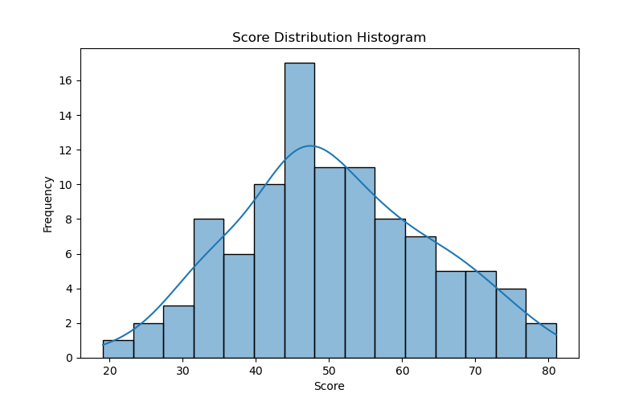
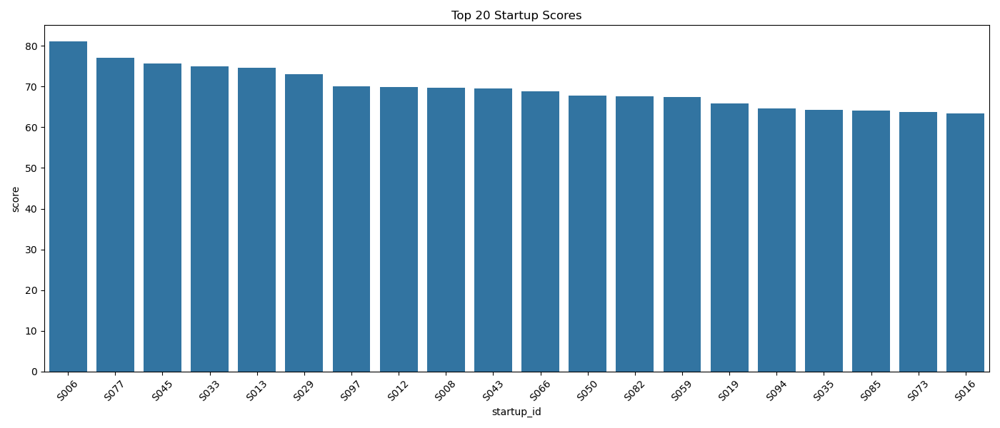
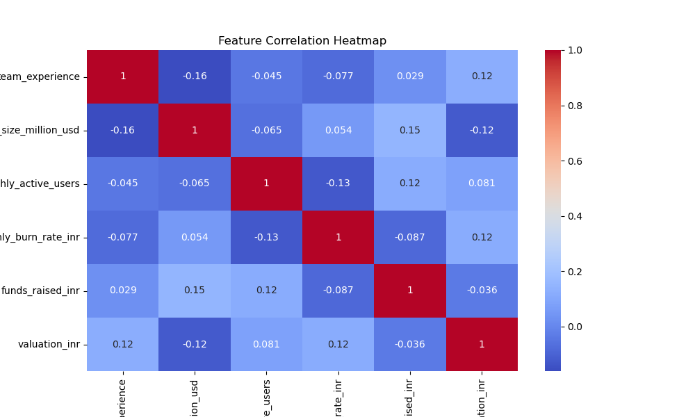
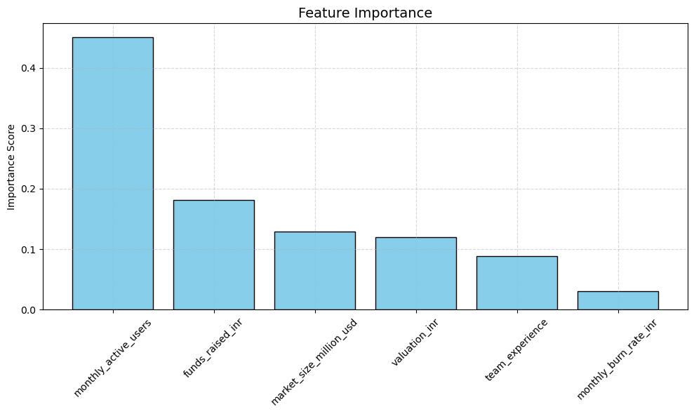
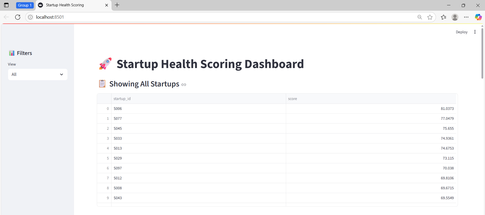
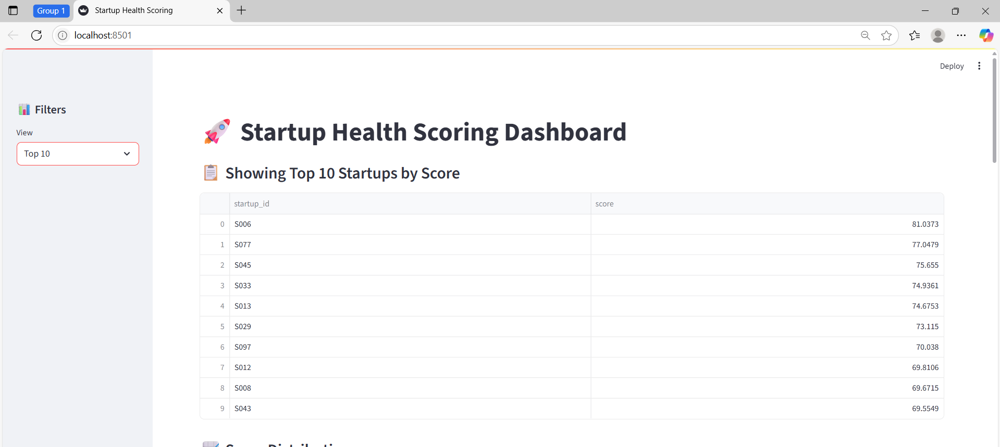
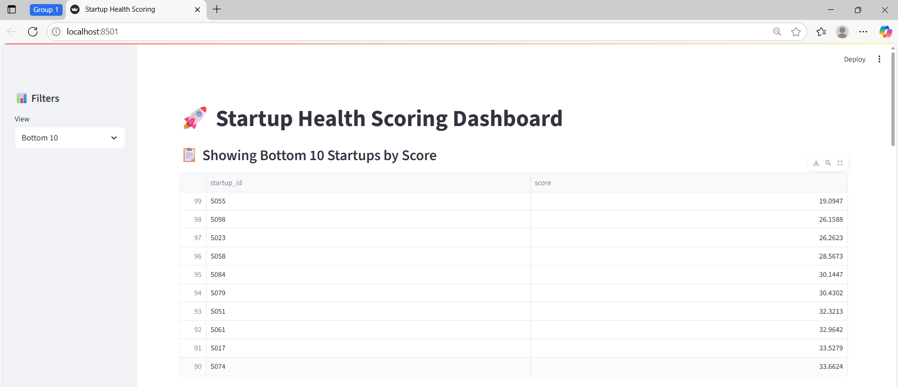
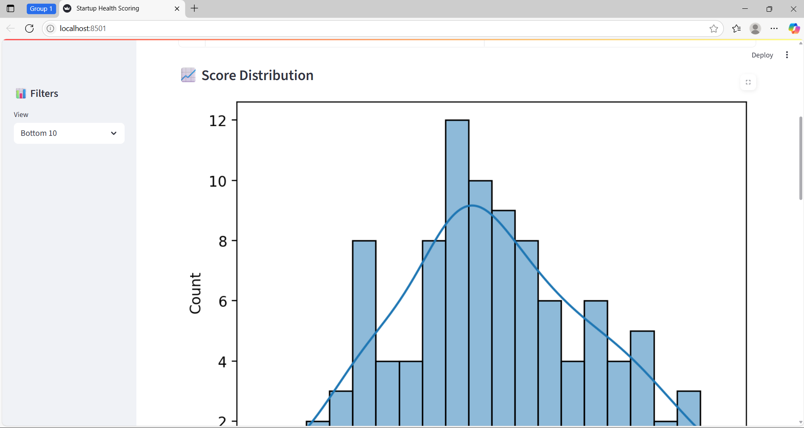
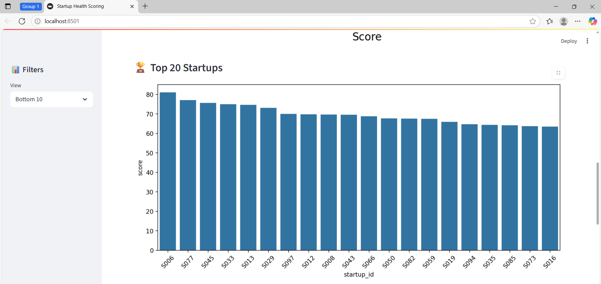
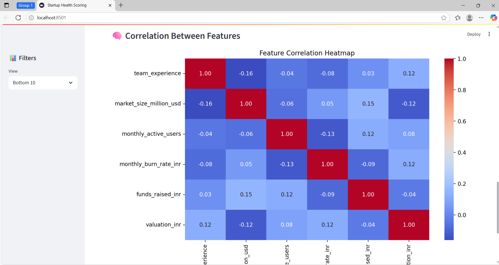

---

# 🚀 Startup Health Scoring

This project evaluates the **health and growth potential** of startups by assigning a **composite score** using a weighted model that considers market, financial, and operational factors. It also features a dynamic **Streamlit dashboard** for interactive analysis and insights.

---

## 📂 Project Structure

```
startup-scoring/
├── streamlit_app.py                  # Interactive Streamlit dashboard
├── requirements.txt                 # Required dependencies
├── notebooks/
│   ├── startup_health_score.ipynb   # Main analysis notebook
│   └── Startup_Scoring_Dataset.csv  # Dataset with startup metrics
├── outputs/
│   ├── score_distribution.png       # Score histogram
│   ├── top_bottom_bar_chart.png     # Bar chart of top 20 scores
│   ├── correlation_heatmap.png      # Feature correlation heatmap
│   └── final_scores.csv             # Final startup scores
└── README.md                        # Project summary
```

---

## 📊 Overview

The goal is to create a **Startup Scoring Model** using a combination of:

* 🔬 **Normalized metrics** (via MinMaxScaler)
* ⚖️ **Business-driven feature weights**
* 🌲 **Random Forest Regressor** for validation
* 📈 **Visual insights** into top/bottom startups
* 🧠 **Correlation analysis** for feature influence

---

## 🧮 Scoring Formula

Each startup is scored out of **100**, using weighted features:

| Feature                    | Weight |
| -------------------------- | ------ |
| Team Experience            | 15%    |
| Market Size (USD)          | 20%    |
| Monthly Active Users       | 25%    |
| Monthly Burn Rate (INR) 🔻 | 10%    |
| Funds Raised (INR)         | 15%    |
| Valuation (INR)            | 15%    |

> Note: Lower burn rate is treated positively by inverting its values.

---

## 🔍 Insights from Analysis

### ✅ Top 10 Startups

The model highlights the top-performing startups based on overall score.

### 🔻 Bottom 10 Startups

Startups with lower performance metrics and high burn rates are ranked lower.

---

## 📊 Visualizations

| Visualization              | Description                                      |
| -------------------------- | ------------------------------------------------ |
| `score_distribution.png`   | Histogram of startup scores                      |
| `top_bottom_bar_chart.png` | Bar chart of top 20 startup scores               |
| `correlation_heatmap.png`  | Heatmap showing correlation between key features |

<p align="center">
  
  
  

</p>

---

## 🤖 ML Validation: Random Forest Regressor

To validate the scoring formula, a **Random Forest model** was trained.

| Metric   | Value                |
| -------- | -------------------- |
| RMSE     | ✅ Low                |
| MAE      | ✅ Low                |
| R² Score | ✅ Strong Correlation |

### 🎯 Feature Importance (Random Forest)

<p align="center">
  
</p>

---

## 🌐 Streamlit Dashboard

Launch the interactive dashboard:

```bash
streamlit run streamlit_app.py
```

### 🎛 Features:

* 📋 Filter by: All / Top 10 / Bottom 10
* 📈 View score distribution
* 🏆 Explore top 20 startups
* 🔍 Heatmap of feature correlations
* 📥 Download final scores as CSV

<p align="center">
  
  
  
   
  


</p>

---

## 📦 Requirements

Install dependencies:

```bash
pip install -r requirements.txt
```

---

## 📁 Dataset

The dataset used is located at:

```
notebooks/Startup_Scoring_Dataset.csv
```

Contains fields like:

* `startup_id`
* `team_experience`
* `market_size_million_usd`
* `monthly_active_users`
* `monthly_burn_rate_inr`
* `funds_raised_inr`
* `valuation_inr`

---

## ✅ Final Output

* 📄 `final_scores.csv` – Ranked scores for all startups
* 🧠 Validated insights using ML
* 📊 Interactive dashboard for dynamic exploration

---

## 🙌 Acknowledgements

* Built with ❤️ using **Python**, **Pandas**, **Seaborn**, **Scikit-learn**, and **Streamlit**
* Inspired by real-world startup evaluation frameworks

---


